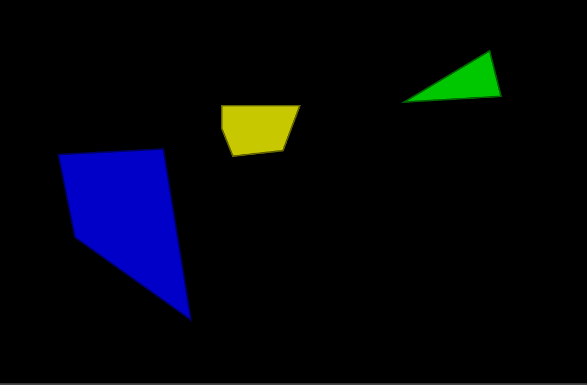

# Polygon fracture with SFML


## Description

An example of how to fracture 2D polygons with [SFML](https://www.sfml-dev.org/) and C++.

⚠️ This is experimental and have serious performance issues.



ℹ️ Bad quality GIF

## Installation

### Dependencies

This project uses `cmake` and SFML library:
```
sudo apt-get install cmake libsfml-dev
```

## Build

1. Clone this repository
2. Compile with `mkdir build && cd build && cmake .. && make`
3. Go to the binary folder `cd ./bin`
4. Run with `./fracture`
